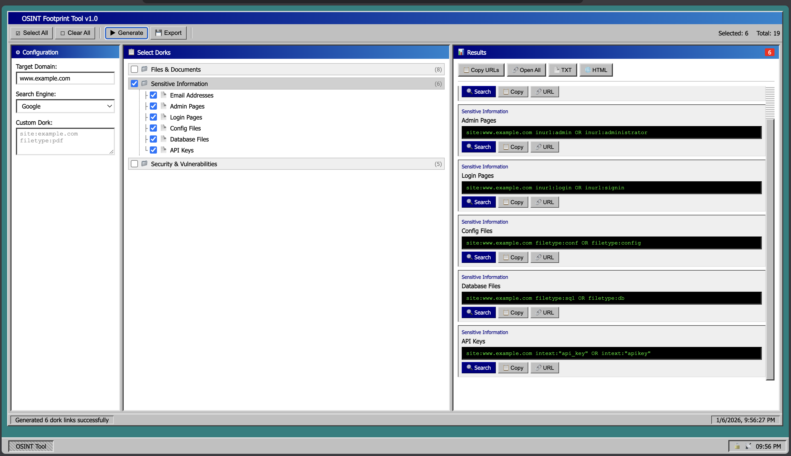

# 🔍 OSINT Footprint Tool v1.0


**A powerful Google Dorking & OSINT reconnaissance tool with a nostalgic Windows 95/98 interface**

[Features](#-features) •
[Installation](#-installation) •
[Usage](#-usage) •
[Dork Categories](#-dork-categories) •
[API](#-api-documentation) •
[Legal](#%EF%B8%8F-legal-disclaimer)


## 📖 About

**OSINT Footprint Tool** is a comprehensive web-based application designed for security researchers, penetration testers, and OSINT professionals. It automates the generation of Google Dorks (advanced search queries) to discover sensitive information, exposed files, vulnerable systems, and other digital footprints of target organizations.

### Why This Tool?

- **100+ Pre-built Dorks**: Covering files, credentials, admin panels, vulnerabilities, and more
- **Multi-Engine Support**: Google, Bing, DuckDuckGo, Yahoo, Yandex, Baidu
- **Retro UI**: Nostalgic Windows 95/98 interface for a unique experience
- **Export Options**: Save results as TXT or HTML reports
- **Custom Dorks**: Create and execute your own search queries
- **No Rate Limiting**: Generate links without API restrictions

---


### Core Features

| Feature | Description |
|---------|-------------|
|  **100+ Google Dorks** | Pre-configured dorks across 12 categories |
|  **Multi-Engine Support** | Google, Bing, DuckDuckGo, Yahoo, Yandex, Baidu |
|  **Retro Windows UI** | Authentic Windows 95/98 look and feel |
|  **Category Organization** | Dorks organized into logical categories |
|  **Custom Dorks** | Create and execute your own queries |
|  **Export Results** | Save as TXT or HTML reports |
|  **Bulk Copy** | Copy all URLs to clipboard at once |
|  **Bulk Open** | Open all results in new tabs |
|  **Keyboard Shortcuts** | Quick actions with hotkeys |
|  **Persistent Storage** | Dorks saved to JSON file |

### Dork Categories Overview

| Category | Count | Description |
|----------|-------|-------------|
| 📄 Files & Documents | 13 | PDF, Excel, Word, SQL, Backup files |
| 🔐 Sensitive Information | 16 | Passwords, API keys, credentials |
| 🛡️ Security Vulnerabilities | 17 | Errors, exposed configs, debug info |
| 🔧 Admin & Control Panels | 17 | CMS, databases, server panels |
| 📁 Exposed Directories | 10 | Open directories, uploads, backups |
| 🔑 Authentication | 8 | Sessions, tokens, SSO endpoints |
| 🌐 Subdomains & Infrastructure | 12 | Dev sites, APIs, internal tools |
| 💻 Source Code | 10 | GitHub, config files, packages |
| 👥 Social & People | 15 | LinkedIn, GitHub, social media |
| 🚨 Critical Exposures | 12 | Database creds, financial data |
| 🌍 Network & IoT | 8 | Cameras, SCADA, network devices |
| 📱 Mobile & Apps | 7 | APK, IPA, mobile configs |

---


## Project Structure Summary

```
osint/
├── README.md           # This file
├── app.py              # Flask application
├── requirements.txt    # Python dependencies
├── dorks.json          # Dorks database (auto-generated)
├── templates/
│   └── index.html      # Main HTML template
├── static/
│   ├── style.css       # Windows 95/98 CSS theme
│   └── script.js       # Frontend JavaScript
└── venv/               # Virtual environment
```
